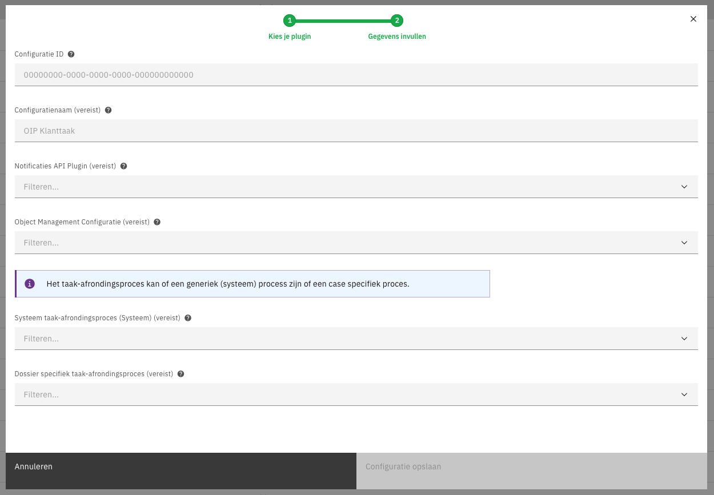
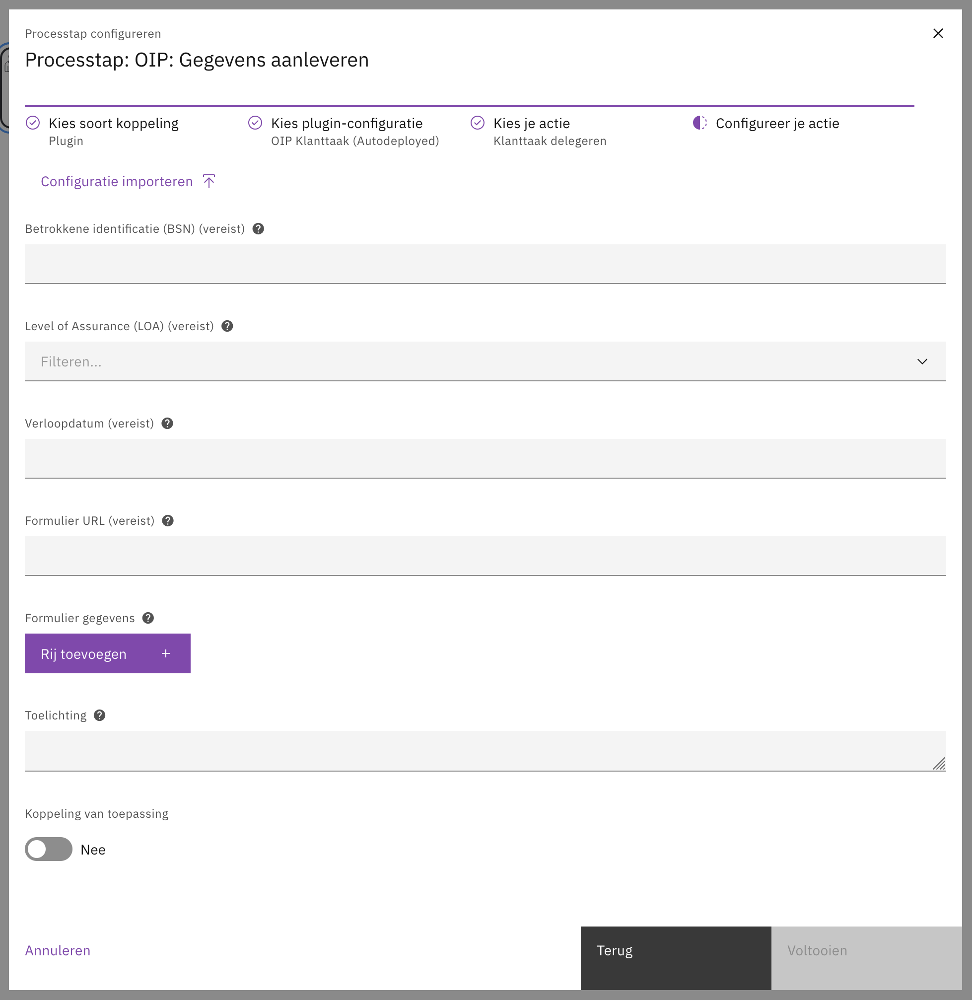
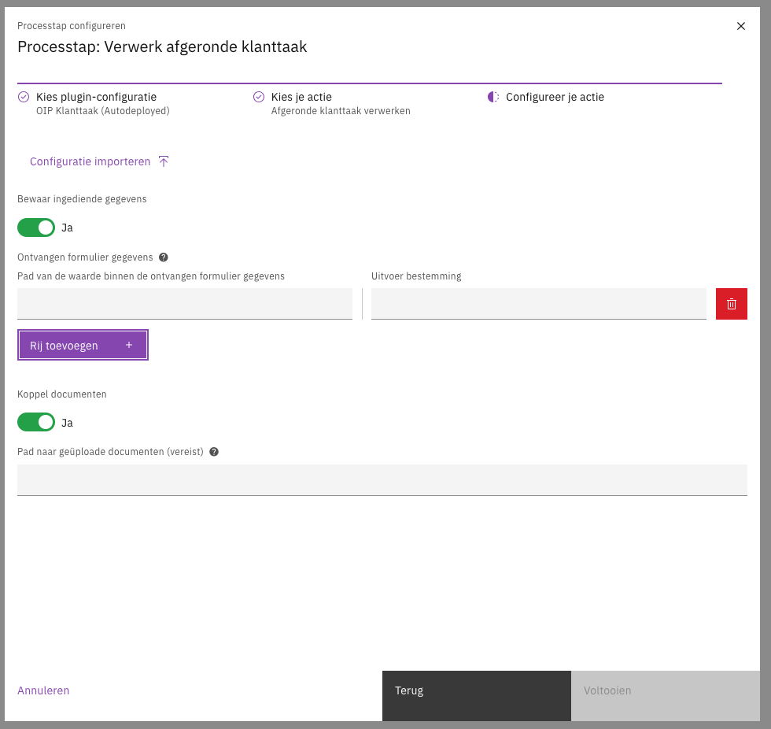

# OIP Klanttaak plugin

The OIP Klanttaak plugin enables delegating (User) tasks created within Valtimo GZAC to the Open Inwoner Platform (OIP). 
This allows tasks to be handled by registered users on the OIP portal, following the 
"[Form taak](https://dienstverleningsplatform.gitbook.io/platform-generieke-dienstverlening-public/patronen/taken/externe-klanttaak#form-taak)" pattern of the
"[Externe klanttaak](https://dienstverleningsplatform.gitbook.io/platform-generieke-dienstverlening-public/patronen/taken/externe-klanttaak)" concept.

## Capabilities

The plugin provides two main actions:

1. **Delegate task**: Creates an object in the Objects API representing the task, making it available in the OIP.
2. **Complete delegated task**: Finalizes the task in Valtimo and updates the status of the related object in the Objects API.

# Dependencies

- **[Valtimo GZAC](https://docs.valtimo.nl/)**: The core platform where the plugin is integrated.
- **[Objecten & Objectypen API](https://objects-and-objecttypes-api.readthedocs.io)**: Used to store the task data.
- **[Open Notificaties](https://open-notificaties.readthedocs.io/)**: Used to receive updates when a task is completed in the OIP.

# Requirements

Before using the plugin, ensure the following are configured:

- **Objecttype definition**: An Objecttype in the Objects API that represents the task datamodel. You can use the [OIP Klanttaak example](assets/oip-klanttaak-example-schema.json) schema as a guideline. 
- **Open Notificaties Subscription**: A subscription to the Objects API to receive updates on task objects.
- **Object Management Configuration**: An Object Management configuration in Valtimo GZAC linked to the task's Objecttype.

## Installation

### Backend

Add the following dependency to your `build.gradle`:

```kotlin
dependencies {
    implementation("com.ritense.valtimoplugins:oip-klanttaak:0.0.1")
}
```

The most recent version can be found [here](https://mvnrepository.com/artifact/com.ritense.valtimoplugins/oip-klanttaak).

### Frontend

Add the following dependency to your `package.json`:

```json
{
  "dependencies": {
    "@valtimo-plugins/oip-klanttaak": "0.0.1"
  }
}
```

The most recent version can be found [here](https://www.npmjs.com/package/@valtimo-plugins/oip-klanttaak?activeTab=versions).

Include the plugin in your `app.module.ts`:

```typescript
import {
    OipKlanttaakPluginModule, oipKlanttaakPluginSpecification
} from '@valtimo-plugins/oip-klanttaak';

@NgModule({
    imports: [
        OipKlanttaakPluginModule,
    ],
    providers: [
        {
            provide: PLUGIN_TOKEN,
            useValue: [
                oipKlanttaakPluginSpecification,
            ]
        }
    ]
})
```

# Configuration

When configuring the plugin in Valtimo, the following properties are required:

- **Notificaties API Plugin**: The configuration for the Open Notificaties plugin.
- **Object Management Configuration**: The UUID of the Object Management configuration for the task.
- **Finalizer Process**: The process definition key for the process that should be started when a task is completed in OIP.
- **Case Definition Version** (Optional): Specific version of the case definition.



## Plugin Actions

### Delegate Task

This action is typically triggered on the CREATE event of a User Task.

Properties:

- **Betrokkene identifier**: The BSN or identifier of the person the task is for.
- **Level of assurance**: Security level required (e.g., Password protected transport, Smartcard).
- **Formulier URI**: Link to the form in OIP.
- **Formulier data mapping** (Optional): List of key-value pairs to pre-fill the form.
- **Toelichting** (Optional): A description or explanation for the task.
- **Koppeling registratie** (Optional): Type of link (e.g., Zaak or Product).
- **Koppeling identifier** (Optional): UUID of the linked object.
- **Doorlooptijd** (Optional): ISO 8601 duration (e.g., P14D).
- **Verloopdatum** (Optional): Deadline for the task.
- **Deadline verlengbaar** (Optional): Boolean indicating if the deadline can be extended.



### Complete Delegated Task

This action is used to finalize the task, usually as a Service Task following the delegation.

Properties:
- **Bewaar ingediende gegevens**: Whether to save the data submitted from OIP into the process.
- **Ontvangen data mapping** (Optional): Mapping of received keys to process variables.
- **Koppel documenten**: Whether to link uploaded documents from OIP to the case.
- **Pad naar documenten** (Optional): The path/variable where documents are stored.



# Technical Details

- Process Variables: The plugin uses verwerkerTaakId to track the link between the Valtimo task and the OIP object, and klanttaakObjectUrl for the URL of the created object.
- Event Listener: The OipKlanttaakEventListener monitors notifications from Open Notificaties. When an object update is received with status uitgevoerd, it automatically completes the corresponding task in Valtimo.